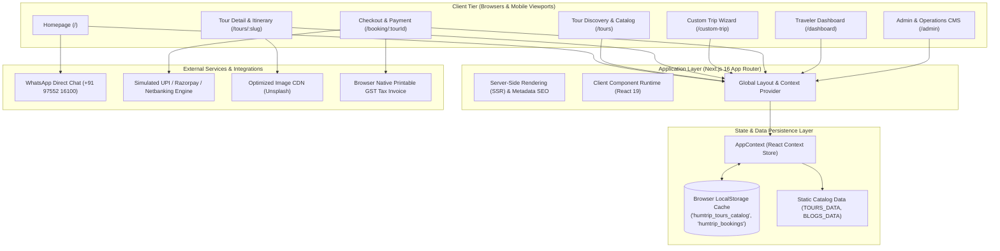
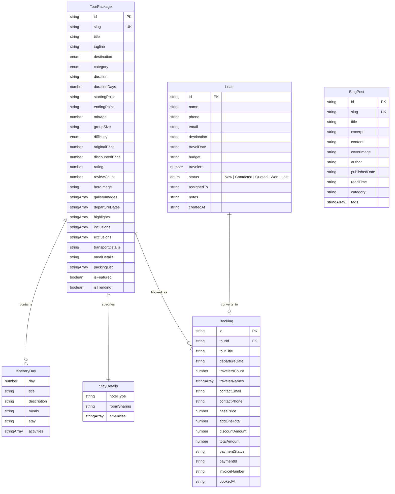
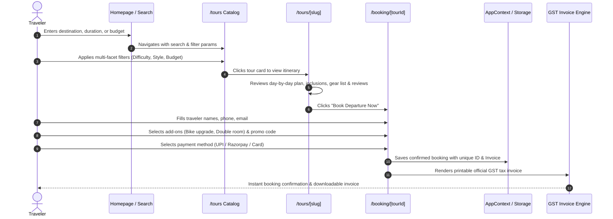
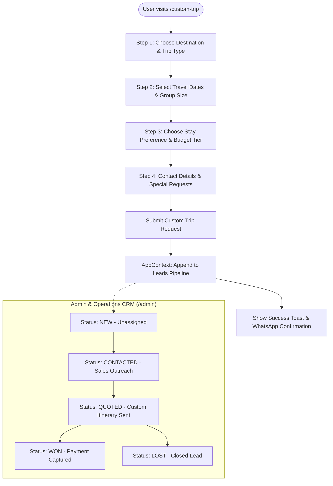

# 🌄 HumTripWale Travel Platform

> **Production-grade, experiential group travel, Himalayan road trip, and custom vacation booking platform.**  
> Crafted with **Next.js 16 (App Router & Turbopack)**, **TypeScript**, and **Tailwind CSS**. Built according to the **HumTripWale Web SRS v1** specification and aligned with official brand guidelines.

---

## 📑 Table of Contents

- [1. Overview & Brand Identity](#1-overview--brand-identity)
- [2. System Architecture](#2-system-architecture)
- [3. Entity-Relationship & Data Models](#3-entity-relationship--data-models)
- [4. User Journey & Architectural Flowcharts](#4-user-journey--architectural-flowcharts)
  - [4.1 Traveler Tour Discovery & Booking Flow](#41-traveler-tour-discovery--booking-flow)
  - [4.2 Custom Trip Planning & CRM Lead Lifecycle](#42-custom-trip-planning--crm-lead-lifecycle)
  - [4.3 Admin Operations & Tour Catalog CMS Flow](#43-admin-operations--tour-catalog-cms-flow)
- [5. Feature Modules Breakdown](#5-feature-modules-breakdown)
  - [5.1 Public Discovery & Customer Facing Pages](#51-public-discovery--customer-facing-pages)
  - [5.2 Traveler Hub & Booking Engine](#52-traveler-hub--booking-engine)
  - [5.3 Admin & Operations Command Center](#53-admin--operations-command-center)
- [6. Directory Structure](#6-directory-structure)
- [7. Getting Started & Installation](#7-getting-started--installation)
- [8. Build, Lint & Verification](#8-build-lint--verification)
- [9. Production Deployment](#9-production-deployment)
- [10. License & Credits](#10-license--credits)

---

## 1. Overview & Brand Identity

**HumTripWale** is an authentic travel company specializing in small-group road trips, high-altitude Himalayan expeditions (Spiti Valley, Ladakh, Himachal, Kashmir), international getaways (Bali, Thailand, Vietnam), and bespoke corporate/honeymoon travel.

### 🎨 Brand Color Palette & Design Rules

To ensure a credible, premium look and feel (and strictly avoiding generic AI templates or sparkle emojis):

| Color Token | Hex Code | Purpose & Usage |
|:---|:---|:---|
| **Deep Ocean Blue** | `#0A192F` / `#071324` | Primary brand canvas, header background, dark cards, bold typography |
| **Brand Amber / Gold** | `#FFA429` / `#EEC41E` | Primary high-impact CTA buttons, highlights, badges, icons |
| **Warm Sand** | `#FAF7F2` | Neutral background surface, card containers, section contrast |
| **Pure White** | `#FFFFFF` | Form cards, input containers, clean modal dialogs |
| **Slate Gray** | `#64748B` / `#94A3B8` | Secondary typography, metadata labels, borders |

- **No AI Tropes**: 0 gradient abuse, 0 sparkle emojis (`✨`), and 0 placeholder texts.
- **Micro-Interactions**: Smooth hover effects, tactile cards, clean pill badges, and accessible contrast.

---

## 2. System Architecture

The application is structured around a modern hybrid Next.js architecture leveraging **Server Components** for fast initial loads and SEO, coupled with **Client Components** for rich interactivity, dynamic filtering, real-time booking calculations, and Admin CMS operations.



---

## 3. Entity-Relationship & Data Models

The following ER diagram describes the primary data contracts defined across the application (`TourPackage`, `ItineraryDay`, `Booking`, `Lead`, and `BlogPost`):



---

## 4. User Journey & Architectural Flowcharts

### 4.1 Traveler Tour Discovery & Booking Flow



---

### 4.2 Custom Trip Planning & CRM Lead Lifecycle



---

### 4.3 Admin Operations & Tour Catalog CMS Flow

```mermaid
flowchart LR
    Admin([Admin logged in at /admin]) --> CMS[Tab 4: Tours Catalog CMS]
    
    CMS --> ActionChoice{Action}
    
    ActionChoice -->|Create New| OpenCreateModal[Open Create Tour Modal]
    ActionChoice -->|Edit Existing| OpenEditModal[Open Edit Tour Modal (Pre-populated)]
    ActionChoice -->|Delete| ConfirmDelete[Confirm Deletion Dialog]
    
    OpenCreateModal --> FormInput[Fill Title, Slug, Pricing, Route, Accommodations]
    OpenEditModal --> FormInput
    
    FormInput --> ItineraryBuilder[Interactive Day-by-Day Itinerary Builder]
    ItineraryBuilder --> AddDay[+ Add Day: Title, Description, Meals, Stay]
    ItineraryBuilder --> RemoveDay[Remove Day]
    
    AddDay --> SaveTour[Save Tour Package]
    RemoveDay --> SaveTour
    
    SaveTour --> AppStateUpdate[Update AppContext Store]
    AppStateUpdate --> LocalStorageSync[Sync to localStorage 'humtrip_tours_catalog']
    
    LocalStorageSync --> LiveCatalogUpdate[Reflects instantly on /tours, /tours/:slug, & /booking/:tourId]
    ConfirmDelete --> DeleteAction[Remove from store & LocalStorage]
```

---

## 5. Feature Modules Breakdown

### 5.1 Public Discovery & Customer Facing Pages

1. **Homepage (`/`)**:
   - **Hero Engine**: Destination search, trip style selector, departure month picker, and quick-filter trending chips.
   - **Guaranteed Departures Calendar**: Live batch tracker with remaining seat counts, departure hubs (Majnu Ka Tila, Leh Airport Hub), and instant booking buttons.
   - **Bento Destination Explorer**: Curated regional cards for Spiti, Ladakh, Himachal, Bali, Kashmir, and Rajasthan.
   - **Curated Tour Showcase**: Filterable tabs for Adventure, Road Trips, Honeymoon, and International circuits.
   - **High-Altitude Safety Standards**: Operational highlights covering certified trip captains, medical oxygen canisters, and sanitized transport.
   - **Verified Reviews & Community Wall**: Genuine testimonials with verified travel tags and direct Instagram photo links.
   - **Floating Quick Connect**: Floating WhatsApp direct chat (+91 97552 16100) and instant callback modal.

2. **Tour Catalog (`/tours`)**:
   - Multi-facet sidebar filters: Destination, Budget Range slider (₹5,000 to ₹100,000), Duration, Travel Category, and Difficulty Grade.
   - Real-time search by keyword and sorting by Price (Low/High), Popularity, and Duration.

3. **Tour Detail View (`/tours/[slug]`)**:
   - Sticky booking drawer with date selector and price calculation.
   - Interactive day-by-day itinerary with altitude graphs, meals, and accommodations.
   - Inclusions / Exclusions checklists, gear checklists, and cancellation policy.

4. **Destination Hubs (`/destinations/[slug]`)**:
   - Deep-dive guides for key regions (Spiti, Ladakh, Bali, Kashmir) with weather charts, best months to visit, local customs, and matching tour circuits.

5. **Custom Trip Planner (`/custom-trip`)**:
   - 4-step wizard for tailored vacations, family packages, and corporate offsites, routing inquiries directly to the CRM.

6. **Travel Guides & Blogs (`/blogs`, `/blogs/[slug]`)**:
   - Editorial articles covering high-altitude acclimatization, packing essentials, and route itineraries.

7. **Contact & Helpline (`/contact`)**:
   - Office addresses (Indore, Delhi, Manali), 24/7 emergency dispatch line, and direct contact form.

---

### 5.2 Traveler Hub & Booking Engine

1. **Checkout & Payment Simulation (`/booking/[tourId]`)**:
   - Step 1: Traveler roster input with age and contact details.
   - Step 2: Add-on selection (Solo tent occupancy, mountain bike rental, paragliding passes).
   - Step 3: Coupon code validation (`HUMTRIP10`, `EARLYBIRD`) and simulated payment (UPI, Razorpay, Net Banking).
   - Step 4: Auto-generated printable GST Tax Invoice with QR verification.

2. **User Dashboard (`/dashboard`)**:
   - Active reservations, downloadable payment vouchers, wishlist manager, and profile settings.

---

### 5.3 Admin & Operations Command Center (`/admin`)

- **Tab 1: Executive KPI Dashboard**: Real-time gross platform revenue, confirmed passenger numbers, active inquiries count, and tour catalog health.
- **Tab 2: CRM Leads Pipeline**: Incoming trip requests, sales agent assignments, quotation notes, and status transitions (*New*, *Contacted*, *Quoted*, *Won*, *Lost*).
- **Tab 3: Bookings Ledger**: Centralized reservations table with traveler names, phone numbers, payment IDs, departure dates, and invoice viewing.
- **Tab 4: Tour Catalog CMS**:
  - Full creation and editing suite for tour circuits.
  - Interactive Day-by-Day Itinerary Builder.
  - Tiered pricing, promotional flags (`isFeatured`, `isTrending`), and image URL management.

---

## 6. Directory Structure

```plaintext
HUMTRIPWALE TRAVEL/
├── app/
│   ├── admin/
│   │   └── page.tsx               # Admin & Operations Panel (KPIs, CRM, Bookings, Tour CMS)
│   ├── blogs/
│   │   ├── [slug]/
│   │   │   └── page.tsx           # Individual blog post article view
│   │   └── page.tsx               # Travel guides & blog catalog
│   ├── booking/
│   │   └── [tourId]/
│   │       └── page.tsx           # 3-step checkout engine & GST Tax Invoice
│   ├── contact/
│   │   └── page.tsx               # Contact page with 24/7 helpline & dispatch hubs
│   ├── custom-trip/
│   │   └── page.tsx               # Interactive 4-step custom trip planning wizard
│   ├── dashboard/
│   │   └── page.tsx               # Traveler self-service dashboard & wishlist
│   ├── destinations/
│   │   └── [slug]/
│   │       └── page.tsx           # Regional destination landing page
│   ├── tours/
│   │   ├── [slug]/
│   │   │   └── page.tsx           # Rich tour details & day-by-day itinerary
│   │   └── page.tsx               # Tour catalog with multi-facet filters & sorting
│   ├── favicon.ico
│   ├── globals.css                # Tailwind CSS tokens & base styles
│   ├── layout.tsx                 # Root layout with Header, Footer, & AppProvider
│   └── page.tsx                   # Production homepage
├── components/
│   ├── home/
│   │   ├── BentoDestinations.tsx  # Bento-style destination explorer
│   │   ├── CommunityWall.tsx      # Verified traveler social proof & community
│   │   ├── DeparturesCalendar.tsx # Fixed departures table & seat tracker
│   │   ├── FeaturedTrips.tsx      # Curated category cards
│   │   ├── HeroSection.tsx        # Authentic hero search engine & trust bar
│   │   ├── SafetyTrust.tsx        # High-altitude safety & captain protocols
│   │   └── Testimonials.tsx       # Verified traveler review cards
│   └── layout/
│       ├── Footer.tsx             # Production footer with official links & credentials
│       ├── Header.tsx             # Streamlined navigation header & clean profile menu
│       └── WhatsAppWidget.tsx     # Floating WhatsApp & callback modal
├── context/
│   └── AppContext.tsx             # Global application state (Tours, Bookings, Leads, Wishlist)
├── data/
│   ├── blogsData.ts               # Curated travel blog articles & guides
│   ├── destinationsData.ts        # Destination profiles, best times to visit, & advisories
│   └── toursData.ts               # Core tour packages, pricing, & itineraries
├── public/
│   ├── logo.svg                   # Official transparent vector logo
│   ├── logo.png                   # Brand raster backup
│   └── logo-icon.png              # App icon
├── next.config.ts                 # Next.js configuration (Remote image domains)
├── package.json                   # Dependencies & build scripts
├── postcss.config.mjs             # PostCSS Tailwind config
├── tailwind.config.ts             # Tailwind CSS configuration
└── tsconfig.json                  # TypeScript compiler settings
```

---

## 7. Getting Started & Installation

### Prerequisites

- **Node.js**: Version `18.18.0` or later (Node 20+ recommended)
- **Package Manager**: `npm` (v9+) or `yarn` / `pnpm`
- **Git**: Configured for repository cloning

### Installation Steps

1. **Clone the repository**:
   ```bash
   git clone https://github.com/drdhavaltrivedi/humtripwale-travel.git
   cd humtripwale-travel
   ```

2. **Install project dependencies**:
   ```bash
   npm install
   ```

3. **Launch the development server with Turbopack**:
   ```bash
   npm run dev
   ```

4. **Open in browser**:
   Navigate to [http://localhost:3000](http://localhost:3000) to view the live application.
   - Admin Panel: [http://localhost:3000/admin](http://localhost:3000/admin)
   - Tour Catalog: [http://localhost:3000/tours](http://localhost:3000/tours)

---

## 8. Build, Lint & Verification

To create an optimized production build and verify TypeScript integrity:

```bash
# Run production build using Turbopack
npm run build

# Start the production server locally
npm run start

# Run ESLint validation
npm run lint
```

---

## 9. Production Deployment

This project is built using standard Next.js conventions and can be deployed with zero additional configuration on **Vercel**, **AWS Amplify**, or any Node.js containerized environment (Docker):

### One-Click Deployment to Vercel

1. Push your code to your GitHub repository.
2. Import the repository in [Vercel Dashboard](https://vercel.com/new).
3. Next.js App Router and Turbopack settings will be detected automatically.
4. Click **Deploy**.

---

## 10. License & Credits

- **Owner**: HumTripWale Travel
- **Website**: [https://www.humtripwale.com](https://www.humtripwale.com)
- **Helpline**: `+91 97552 16100` | `contact@humtripwale.com`
- **Copyright**: © 2026 HumTripWale. All rights reserved. Handcrafted in India.
