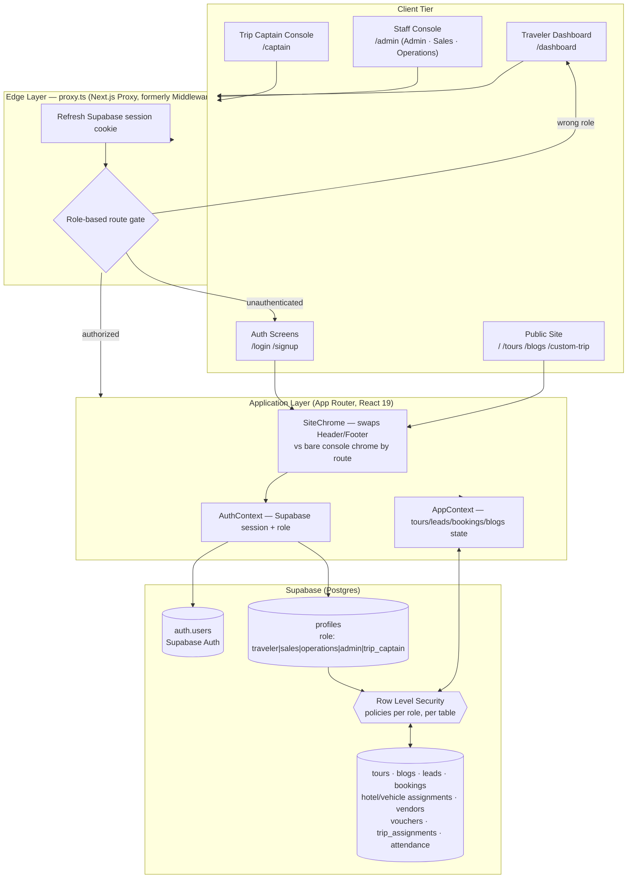
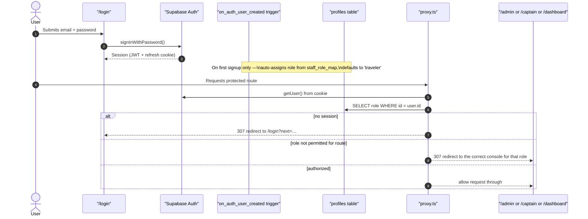
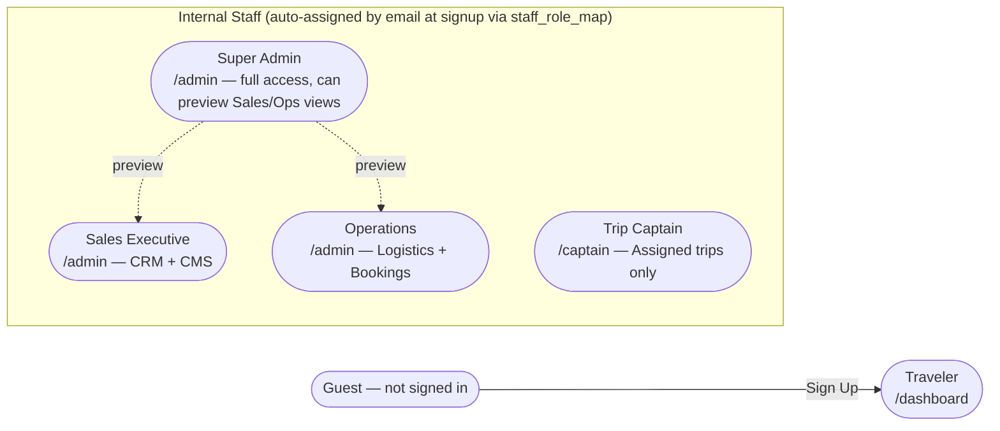
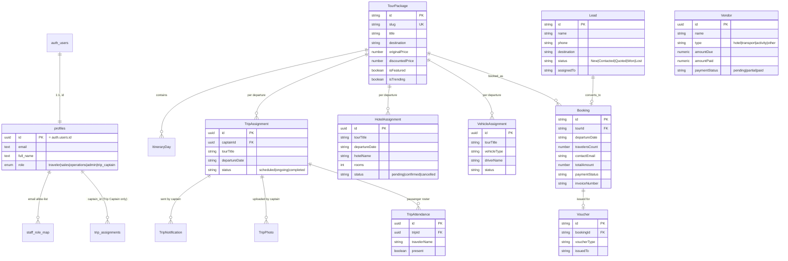
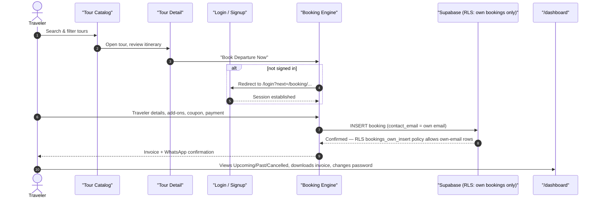
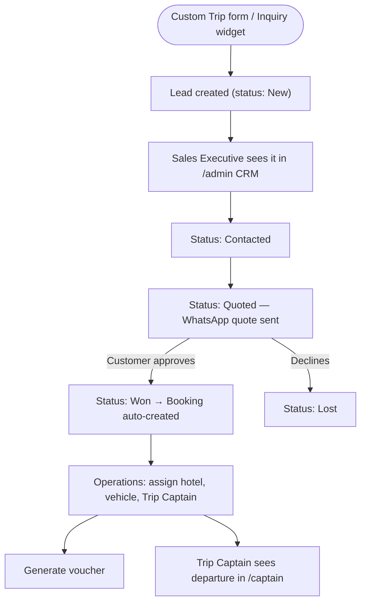
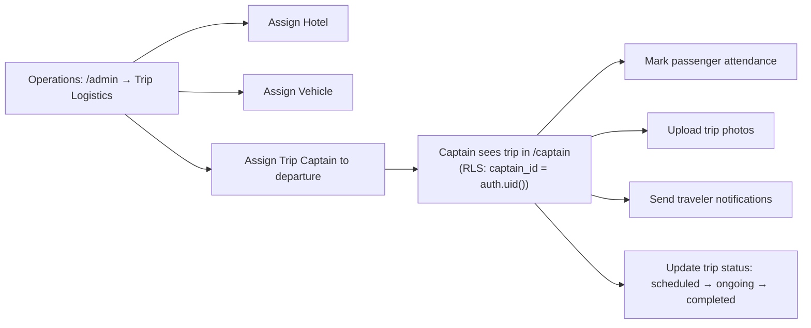

# 🌄 HumTripWale Travel Platform

> **Production-grade, role-based travel operations platform.**
> Built with **Next.js 16 (App Router, Turbopack, Proxy)**, **TypeScript**, **Tailwind CSS**, and **Supabase** (Postgres + Auth + Row Level Security). Built to the **HumTripWale Web SRS v1** specification — every screen, role, and permission below is traced directly back to SRS §5 (User Roles & Permissions) and §6 (Detailed User Flow).

---

## 📑 Table of Contents

- [1. Overview & Brand Identity](#1-overview--brand-identity)
- [2. System Architecture](#2-system-architecture)
- [3. Authentication & Authorization](#3-authentication--authorization)
- [4. User Roles, Screens & Permission Matrix](#4-user-roles-screens--permission-matrix)
- [5. Entity-Relationship & Data Models](#5-entity-relationship--data-models)
- [6. User Journey Flowcharts](#6-user-journey-flowcharts)
- [7. Feature Modules Breakdown](#7-feature-modules-breakdown)
- [8. Directory Structure](#8-directory-structure)
- [9. Scalability & Reliability](#9-scalability--reliability)
- [10. Getting Started & Installation](#10-getting-started--installation)
- [11. Build, Lint & Verification](#11-build-lint--verification)
- [12. Production Deployment](#12-production-deployment)
- [13. License & Credits](#13-license--credits)

---

## 1. Overview & Brand Identity

**HumTripWale** is a travel company specializing in small-group road trips, high-altitude Himalayan expeditions (Spiti Valley, Ladakh, Himachal, Kashmir), international getaways (Bali, Thailand), and bespoke corporate/honeymoon travel. The platform serves two audiences on one codebase: **travelers** booking trips on the public site, and **internal staff** (Sales, Operations, Trip Captains, Admin) running the business through a dedicated console.

### 🎨 Brand Color Palette

| Color Token | Hex Code | Purpose & Usage |
|:---|:---|:---|
| **Deep Ocean Blue** | `#0A192F` / `#071324` | Primary brand canvas, header background, dark cards |
| **Brand Amber / Gold** | `#FFA429` / `#EEC41E` | Primary CTA buttons, highlights, badges, icons |
| **Warm Sand** | `#FAF7F2` | Neutral background surface, card containers |
| **Pure White** | `#FFFFFF` | Form cards, input containers, modals |
| **Slate Gray** | `#64748B` / `#94A3B8` | Secondary typography, metadata, borders |

---

## 2. System Architecture

The app is a single Next.js 16 deployment with **two front doors**: the public marketing/booking site (customer-facing, uses `Header`/`Footer`) and an internal staff console (`/admin`, `/captain` — bare chrome, its own nav). Both share the same Supabase backend, but access is enforced at three layers: **Proxy** (edge redirect), **RLS** (database), and **UI** (what's rendered).



**Why this matters:** the Proxy check is a fast, optimistic UX redirect (keeps people off screens they can't use); RLS is the actual security boundary enforced by Postgres on every query, regardless of what the UI does. A bug in a React component can never leak another role's data, because the database itself refuses the query.

---

## 3. Authentication & Authorization

Real email/password authentication via **Supabase Auth**, with roles resolved server-side — not a client-side toggle.



**Defense in depth:**
1. **Edge (Proxy)** — redirects unauthenticated or wrong-role visitors before the page even renders.
2. **Database (RLS)** — every table (`leads`, `bookings`, `tours`, `hotel_assignments`, `trip_assignments`, …) has row-level policies keyed off the caller's role in `profiles`, via a `SECURITY DEFINER` helper `current_role_is(roles[])`. Anonymous/traveler requests to staff-only tables return empty, not an error and not real data.
3. **UI** — staff consoles only render the actions a role's real session grants; a Sales account can't even see the Super Admin persona switcher (`/admin` locks `roleMode` to the session's real role, not a URL query param).

No role can self-escalate: the `staff_role_map` allow-list (which email → which role) is itself RLS-locked to Admin only, and `profiles.role` can only be updated by an Admin — a traveler patching their own profile row cannot change their `role` field (`with check` on the `profiles_update_own` policy blocks it).

---

## 4. User Roles, Screens & Permission Matrix

Five roles, straight from SRS §5, each with its own dedicated experience — not one screen with a persona toggle:

| Role | Landing Screen | Can | Cannot |
|---|---|---|---|
| **Guest** (not logged in) | Public site | Browse tours, read blogs, search packages, submit enquiry | Book, wishlist, see any dashboard |
| **Traveler** (Registered User) | `/dashboard` | Book tours, save wishlist, manage profile, change password, download invoice, track booking (Upcoming/Past/Cancelled), review tours | Access `/admin`, `/captain`, or any other traveler's data |
| **Sales Executive** | `/admin` (locked to Sales view) | View & update leads, create bookings, manage customers, edit tour/blog CMS | Vendor finance, hotel/vehicle assignment, Trip Captain assignment |
| **Operations Team** | `/admin` (locked to Operations view) | Assign hotels & vehicles, manage departures, vendor finance tracking, generate vouchers, assign Trip Captains, view leads/bookings | Edit tour/blog CMS content (view-only via public catalog) |
| **Trip Captain** | `/captain` | View assigned trips, view passenger list, mark attendance, upload trip photos, send traveler notifications | Anything outside their own assigned trips; no access to `/admin` |
| **Admin (Super Admin)** | `/admin` (full view, can preview other desks) | Full system access — Users, Tours, CMS, Payments, Reports, Leads, Logistics, Vendors, Trip Captains, deployment health | — (unrestricted) |



### Screen ↔ Role mapping (what's actually rendered)

| Screen | Guest | Traveler | Sales | Operations | Trip Captain | Admin |
|---|:---:|:---:|:---:|:---:|:---:|:---:|
| Public site (`/`, `/tours`, `/blogs`) | ✅ | ✅ | ✅ | ✅ | ✅ | ✅ |
| `/dashboard` (bookings, wishlist, profile, password) | ❌ redirect to login | ✅ | staff can preview | staff can preview | ❌ | ✅ |
| `/admin` → KPI Dashboard | ❌ | ❌ | ❌ | ❌ | ❌ | ✅ |
| `/admin` → CRM Leads Pipeline | ❌ | ❌ | ✅ | ✅ (as inquiries) | ❌ | ✅ |
| `/admin` → Tour/Blog CMS | ❌ | ❌ | ✅ | ❌ (RLS blocks writes) | ❌ | ✅ |
| `/admin` → Bookings/Manifests | ❌ | ❌ | ✅ | ✅ | ❌ | ✅ |
| `/admin` → Trip Logistics (hotels/vehicles/vendors/vouchers/captains) | ❌ | ❌ | ❌ | ✅ | ❌ | ✅ |
| `/captain` (assigned trips, attendance, photos, notifications) | ❌ | ❌ | ❌ | ❌ | ✅ (own trips only) | ✅ (oversight) |

This table is enforced twice — once by `proxy.ts` (route-level redirect) and again by Postgres RLS (data-level), so a mis-rendered button can never expose data the policy doesn't allow.

---

## 5. Entity-Relationship & Data Models



All operational tables (`hotel_assignments`, `vehicle_assignments`, `vendors`, `vouchers`, `trip_assignments`, `trip_attendance`, `trip_photos`, `trip_notifications`) live in [`supabase/migrations/0002_operations_and_trip_captain.sql`](supabase/migrations/0002_operations_and_trip_captain.sql); hotel and vehicle image extensions and master catalog tables live in [`supabase/migrations/0003_hotels_and_vehicles.sql`](supabase/migrations/0003_hotels_and_vehicles.sql); auth/roles/RLS foundation is in [`0001_auth_and_roles.sql`](supabase/migrations/0001_auth_and_roles.sql).

---

## 6. User Journey Flowcharts

### 6.1 Traveler: Discovery → Booking → Dashboard



### 6.2 Lead → Sales → Booking (CRM lifecycle)



### 6.3 Operations → Trip Captain handoff



---

## 7. Feature Modules Breakdown

### 7.1 Public Discovery & Customer-Facing Pages
Homepage, Tour Catalog with multi-facet filters, Tour Detail with itinerary/inclusions/FAQ, Destination Hubs, Custom Trip Planner (4-step wizard → CRM lead), Travel Guides/Blogs, Contact.

### 7.2 Traveler Hub (`/dashboard`)
Bookings split into **Upcoming / Past / Cancelled** tabs, GST invoice download, Saved Wishlist, Saved Travelers, **Profile & Security** (change password via Supabase Auth), Helpline & FAQs.

### 7.3 Sales Console (`/admin`, locked to Sales)
CRM Leads Pipeline (status transitions, WhatsApp quote templates), Tour/Blog CMS, Client Bookings.

### 7.4 Operations Console (`/admin`, locked to Operations)
Departure Manifests, **Trip Logistics** (Hotel Assignments, Vehicle Assignments, Vendor Finance tracking, Voucher generation, Trip Captain assignment), Traveler Inquiries.

### 7.5 Trip Captain Console (`/captain`)
My Assigned Trips → per-trip: Passenger List & Attendance check-in, Trip Photo uploads, Send Notification to travelers, trip status (scheduled/ongoing/completed).

### 7.6 Super Admin Console (`/admin`, full access)
Executive KPI Dashboard, everything Sales and Operations can see (with a persona-preview switcher), Cloud/Deployment health.

---

## 8. Directory Structure

```plaintext
HUMTRIPWALE TRAVEL/
├── proxy.ts                        # Edge route guard (Next.js 16 "Proxy", formerly middleware.ts)
├── app/
│   ├── admin/page.tsx               # Staff console: Admin / Sales / Operations (role-gated)
│   ├── captain/page.tsx             # Trip Captain console (own trips only)
│   ├── login/page.tsx               # Real Supabase Auth sign-in
│   ├── signup/page.tsx              # Traveler self-signup (staff accounts pre-provisioned)
│   ├── dashboard/page.tsx           # Traveler self-service hub
│   ├── tours/, blogs/, destinations/, booking/, custom-trip/, contact/, invoice/
│   └── layout.tsx                   # Root layout — AuthProvider → AppProvider → SiteChrome
├── components/
│   ├── admin/OperationsLogistics.tsx # Hotels/Vehicles/Vendors/Vouchers/Captain assignment UI
│   ├── layout/SiteChrome.tsx        # Swaps marketing chrome vs bare console chrome by route
│   ├── layout/Header.tsx, Footer.tsx
│   └── home/, tours/, common/
├── context/
│   ├── AuthContext.tsx              # Supabase session + role (source of truth for identity)
│   └── AppContext.tsx               # Tours/Leads/Bookings/Blogs state, derives `user` from AuthContext
├── lib/
│   ├── supabase/client.ts           # Browser Supabase client (@supabase/ssr)
│   ├── supabase/server.ts           # Server Component Supabase client
│   ├── supabase/proxy.ts            # Session refresh + role-gate logic used by proxy.ts
│   ├── supabaseService.ts           # Tours/leads/bookings/blogs CRUD
│   ├── operationsService.ts         # Hotels/vehicles/vendors/vouchers CRUD
│   └── captainService.ts            # Trip assignments/attendance/photos/notifications CRUD
├── supabase/migrations/
│   ├── 0001_auth_and_roles.sql      # profiles, roles, RLS, staff_role_map, auto-assign trigger
│   └── 0002_operations_and_trip_captain.sql # Logistics + Trip Captain schema & RLS
└── data/                            # Static seed/fallback catalog data
```

---

## 9. Scalability & Reliability

- **Stateless app tier**: Next.js Server Components + Proxy hold no session state in memory — session lives in the Supabase JWT cookie, so the app scales horizontally on Vercel/any Node host without sticky sessions.
- **Database-enforced authorization**: RLS policies run inside Postgres, not application code — adding a new client (mobile app, partner integration) inherits the same security guarantees automatically, no re-implementing permission checks.
- **Read-heavy public catalog, write-light staff console**: `tours`/`blogs` are public-read (`using (true)`), cacheable at the edge; writes are staff-only and low-volume, so there's no contention between the high-traffic public site and the internal console.
- **Role additions are additive, not breaking**: the `user_role` enum and `staff_role_map` allow-list mean a new role (e.g. a future "Affiliate Partner" per SRS Phase 5) is a migration + a `proxy.ts` route rule — no rewrite of existing role logic.
- **Security-definer helper (`current_role_is`)** centralizes the "am I staff" check so every table's policy stays a one-line reference instead of duplicated role logic that could drift out of sync.
- **Migration-first schema**: every schema change is a numbered file under `supabase/migrations/`, applied via Supabase MCP/CLI — reproducible across dev/staging/prod, matching SRS §21 environment promotion (`Development → Staging → Production`).
- **Known follow-ups for scale**: move file uploads (trip photos) from raw URL fields to Supabase Storage with signed URLs; add pagination to `leads`/`bookings` fetches once volume grows past a few hundred rows; introduce `pg_cron` for scheduled digest emails when notification volume increases.

---

## 10. Getting Started & Installation

### Prerequisites
- **Node.js** 18.18+ (20+ recommended)
- **npm** 9+
- A **Supabase** project (URL + anon key in `.env.local`)

### Installation

```bash
git clone https://github.com/drdhavaltrivedi/humtripwale-travel.git
cd humtripwale-travel
npm install
```

Apply the database migrations (via Supabase SQL Editor, or the Supabase MCP tool if connected):

```bash
# In order:
supabase/migrations/0001_auth_and_roles.sql
supabase/migrations/0002_operations_and_trip_captain.sql
```

Seed staff accounts by editing `staff_role_map` in `0001_auth_and_roles.sql` with real emails, then have each person sign up at `/signup` with that exact email — their role is auto-assigned on first login.

```bash
npm run dev
```

- Public site: [http://localhost:3000](http://localhost:3000)
- Traveler login: [http://localhost:3000/login](http://localhost:3000/login)
- Staff console: [http://localhost:3000/admin](http://localhost:3000/admin) (Admin/Sales/Operations)
- Trip Captain console: [http://localhost:3000/captain](http://localhost:3000/captain)

---

## 11. Build, Lint & Verification

```bash
npm run build   # Production build (Turbopack) + TypeScript check
npm run start   # Serve the production build locally
npm run lint    # ESLint
```

---

## 12. Production Deployment

Standard Next.js conventions — deploys with zero extra config on **Vercel**:

1. Push to GitHub.
2. Import the repo at [vercel.com/new](https://vercel.com/new).
3. Set `NEXT_PUBLIC_SUPABASE_URL` and `NEXT_PUBLIC_SUPABASE_ANON_KEY` env vars.
4. Deploy. `proxy.ts` runs at the edge automatically — no extra platform config needed.

---

## 13. License & Credits

- **Owner**: HumTripWale Travel
- **Website**: [https://www.humtripwale.com](https://www.humtripwale.com)
- **Helpline**: `+91 97552 16100` | `contact@humtripwale.com`
- **Copyright**: © 2026 HumTripWale. All rights reserved.
